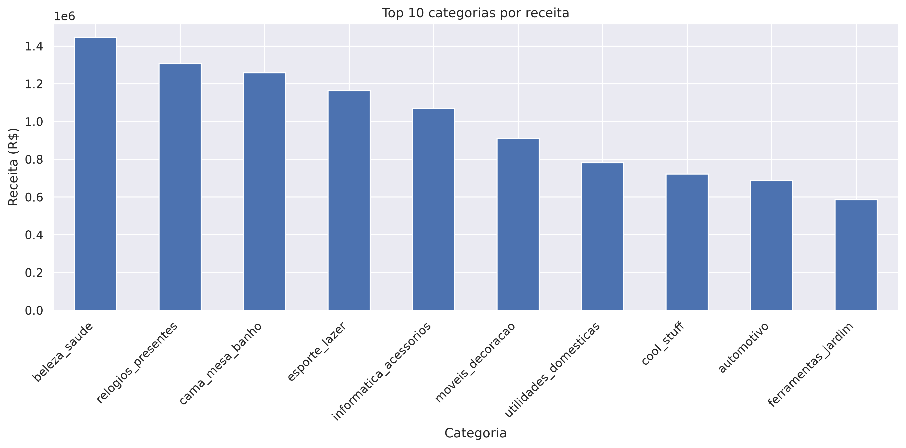
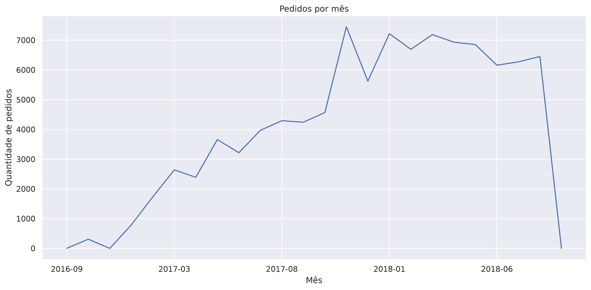
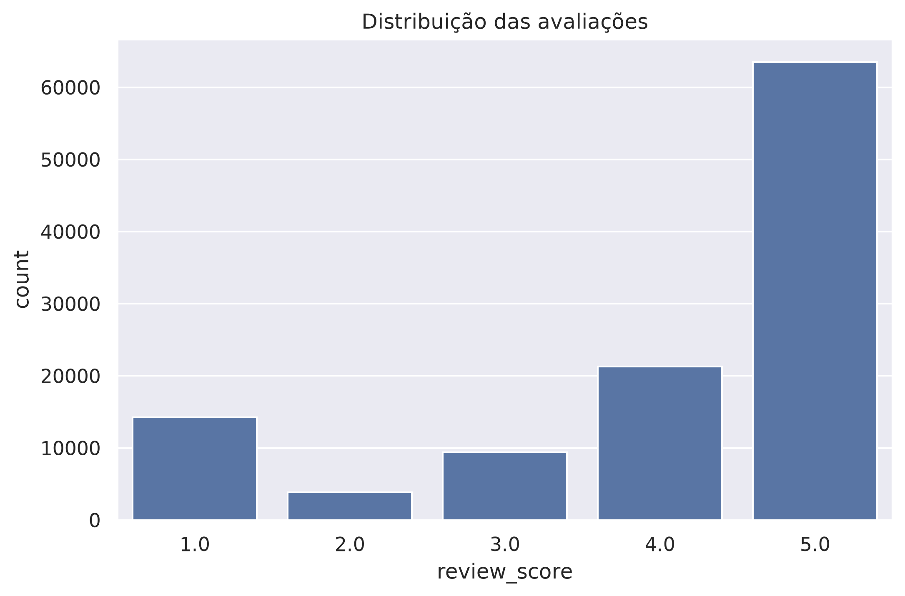

# 📊 Análise Exploratória de Dados - Olist E-commerce

Projeto de portfólio desenvolvido com Python para explorar o conjunto de dados público da Olist, realizando limpeza, tratamento, integração e visualização dos dados para gerar insights sobre vendas, clientes e desempenho do e-commerce.

---

## 🎯 Objetivo

O objetivo deste projeto é analisar o comportamento das vendas da Olist, identificar padrões de consumo, avaliar a satisfação dos clientes e responder a perguntas de negócio por meio de técnicas de Análise Exploratória de Dados (EDA).

---

## 📂 Dataset

Foi utilizado o **Brazilian E-Commerce Public Dataset by Olist**, um conjunto de dados público que reúne informações reais de pedidos realizados em um marketplace brasileiro entre 2016 e 2018.

O dataset contém informações sobre:

- Clientes
- Pedidos
- Produtos
- Itens dos pedidos
- Avaliações
- Pagamentos
- Vendedores
- Geolocalização

---

## 🛠️ Tecnologias Utilizadas

- Python
- Pandas
- NumPy
- Matplotlib
- Seaborn
- Jupyter Notebook

---

## 📋 Etapas da Análise

O projeto foi desenvolvido seguindo as principais etapas de uma Análise Exploratória de Dados:

- Importação das bibliotecas
- Carregamento dos dados
- Exploração inicial
- Limpeza e tratamento
- Integração das tabelas utilizando `merge()`
- Engenharia de atributos
- Construção de indicadores
- Visualização dos resultados
- Geração de insights

---

## 📊 Análises Realizadas

Durante o projeto foram desenvolvidas análises como:

- Receita total
- Ticket médio
- Receita por categoria
- Ticket médio por categoria
- Avaliação média por categoria
- Relação entre receita e avaliação
- Evolução dos pedidos ao longo do tempo
- Distribuição das avaliações
- Pedidos por estado
- Tempo médio de entrega

---

## 💡 Principais Insights

- A receita está concentrada em poucas categorias de produtos.
- O ticket médio varia entre as categorias analisadas.
- A maioria das avaliações dos clientes é positiva.
- Houve aumento significativo do volume de pedidos durante a Black Friday.
- Os estados da região Sudeste concentram grande parte das vendas.
- O tempo médio de entrega mostrou-se consistente para operações de e-commerce.

---

## 📸 Visualizações

As principais análises geraram gráficos como:

- Receita por Categoria
- Ticket Médio por Categoria
- Avaliação Média por Categoria
- Receita × Avaliação
- Sazonalidade das Vendas
- Distribuição das Avaliações
- Pedidos por Estado
- Tempo Médio de Entrega

## 📸 Principais Visualizações

### Receita por categoria



### Sazonalidade dos pedidos



### Distribuição das avaliações



## 📁 Estrutura do Projeto

```text
eda-vendas-olist/
│
├── data/
├── imagens/
├── notebooks/
│   └── eda_vendas_olist.ipynb
├── README.md
├── requirements.txt
└── .gitignore
```

---

## 🚀 Como Executar

Clone o repositório:

```bash
git clone https://github.com/marianyreis/eda-vendas-olist.git
```

Entre na pasta do projeto:

```bash
cd eda-vendas-olist
```

Crie um ambiente virtual (opcional):

```bash
python -m venv .venv
source .venv/bin/activate
```

Instale as dependências:

```bash
pip install -r requirements.txt
```

Abra o notebook:

```bash
jupyter notebook
```

---

## 📚 Aprendizados

Durante este projeto foi possível praticar:

- Manipulação de dados com Pandas
- Limpeza e tratamento de dados
- Integração de múltiplas tabelas
- Engenharia de atributos
- Visualização de dados
- Construção de indicadores de negócio
- Interpretação de resultados

---

## 👩‍💻 Autora

**Mariany Reis**

Projeto desenvolvido como parte do meu portfólio para vagas na área de Análise de Dados.

🔗 GitHub: https://github.com/marianyreis